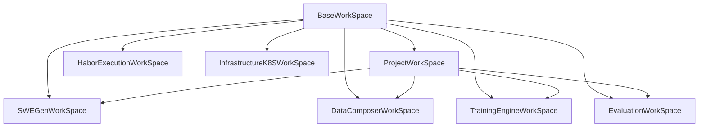

# SWE-Lego-Live Architecture

## Purpose
`SWE-Lego-Live` is an agent-driven system for running the full LLM development loop through natural language interaction. The system should let users describe goals, let the agent coordinate the pipeline, and keep all project and module state human-readable.

This project uses software engineering as the first concrete domain, but the architecture is intended to stay generic.

## Core Idea
The architecture is built around two top-level concepts:

- `AgentOrchestrator`: decides what to do next
- `WorkSpace`: stores what the system knows right now

All other modules are execution modules that read from and write to `WorkSpace`.

## Layers

### UI Layer
- `AgentOrchestrator`
- `WorkSpace`

### Core Layer
- `SWEGen`
- `DataComposer`
- `TrainingEngine`
- `Evaluation`

### Execution Layer
- `HaborExecution`

### Infrastructure Layer
- `InfrastructureK8S`

## WorkSpace
`WorkSpace` is a uniform recursive structure and a reusable module object.

- The outer `WorkSpace` represents the whole project.
- Each submodule owns one child `WorkSpace`.
- Outer and inner nodes use the same shape.
- Different `WorkSpace` nodes may specialize or extend a shared base shape, similar to objects in object-oriented design.
- A `WorkSpace` may optionally attach a concrete code repository or a small repo set.
- A `WorkSpace` may own its own rule document `program.md`.

```yaml
name: workspace_name
summary: human_readable_summary

repo: null
program: program.md

inputs: {}
config: {}
status: {}
outputs: {}
artifacts: []
children: {}
```

### Field Meaning
- `repo`: optional attached code repository or repo collection for this `WorkSpace`
- `program`: the rule document that defines how this `WorkSpace` should be interpreted and extended
- `inputs`: dependencies required before the scope can run
- `config`: editable settings and local policy
- `status`: current runtime state
- `outputs`: structured results produced by this scope
- `summary`: human-facing summary of what happened and what is next
- `artifacts`: archived files or object references
- `children`: nested `WorkSpace` nodes

For the detailed `WorkSpace` authoring contract, see `program.md`.

### Root WorkSpace Repo Example
For the root `WorkSpace`, `repo` may point to multiple concrete work areas owned by the project. For example:

```yaml
repo:
  - path: /mnt/haoli/code/SWE-Lego-Live/data_composer
  - path: /mnt/haoli/code/SWE-Lego-Live/SWE-gen
  - path: /mnt/haoli/code/SWE-Lego-Live/training
```

Each attached repo may also own its own local `program.md`.

## WorkSpace Inheritance Model
`WorkSpace` can be viewed as a base object shape.

- The global project `WorkSpace` is the root object.
- Each module `WorkSpace` inherits the same base fields.
- A module may extend the shared shape with module-specific subfields while still preserving the common contract.
- Because every module follows the same top-level structure, `WorkSpace` nodes can be chained, compared, merged, and visualized consistently.

This is similar to object-oriented design:
- shared top-level fields define the common interface
- each module-specific `WorkSpace` is a specialized object
- relationships between `WorkSpace` nodes can be shown as an inheritance or specialization graph

## WorkSpace Inheritance Diagram



## WorkSpace-Oriented Collaboration
The system is designed around `WorkSpace`-oriented collaboration rather than file-by-file collaboration.

- Every important node in the system should be represented as a `WorkSpace`.
- Each `WorkSpace` has its own local contract through `program.md`.
- Each team member can work on one `WorkSpace` module independently, as long as they preserve the shared top-level shape.
- Collaboration happens by reading and updating `WorkSpace` nodes, not by inventing custom module-specific document structures.
- The root `WorkSpace` acts as the shared coordination surface across multiple repos and child modules.
- Child `WorkSpace` nodes inherit the common structure but can extend their internal details locally.

## SWE Collaboration Through WorkSpace
For the SWE use case, `WorkSpace` is the main collaboration unit across people, agents, modules, and repos.

### Root SWE WorkSpace
The root `WorkSpace` should describe the whole SWE project state:
- the current SWE objective
- the active repos or repo groups involved in the current iteration
- the shared constraints, budgets, and rules
- the global progress summary
- the set of child `WorkSpace` nodes that represent concrete SWE modules

In practice, the root node is where the team aligns on:
- what SWE capability is being improved
- which repos are currently in scope
- which child modules are expected to produce outputs next
- what the latest global summary says

### Child SWE WorkSpaces
Each concrete SWE module should be represented as its own child `WorkSpace`.

Typical examples are:
- `SWEGen`
- `DataComposer`
- `TrainingEngine`
- `Evaluation`

But the important point is not the module name. The important point is that each module is represented through the same `WorkSpace` contract:
- `repo`
- `program`
- `inputs`
- `config`
- `status`
- `outputs`
- `summary`
- `artifacts`
- `children`

This gives every SWE module the same collaboration surface.

### How SWE Collaboration Actually Happens
In the SWE workflow, collaboration should happen through `WorkSpace` updates rather than ad hoc document edits.

1. The root `WorkSpace` declares the current SWE goal and active repos.
2. `AgentOrchestrator` decides which child `WorkSpace` should move next.
3. A module owner or agent reads that child `WorkSpace` plus its local `program.md`.
4. The module updates its own `inputs`, `status`, `outputs`, `summary`, and `artifacts`.
5. The root `WorkSpace` incorporates those updates into the global SWE picture.
6. The next module continues from the updated `WorkSpace` state.

This means the handoff between modules is not only "run the next component". The real handoff is:
- read the current `WorkSpace`
- understand the current module contract
- produce the next valid `WorkSpace` update

### Why This Matters For SWE
SWE workflows are messy: repositories change, generated tasks change, training outputs change, and evaluation results can invalidate previous assumptions.

Using `WorkSpace` as the collaboration primitive gives the project:
- a stable shared shape even when module internals differ
- a clean handoff surface between module owners
- a way for agents and humans to collaborate through the same object model
- a way to attach concrete SWE repos to the exact `WorkSpace` nodes that depend on them
- a way to accumulate summaries and artifacts without forcing every team member into the same implementation details

### The Project Graph Should Be Generated From WorkSpace
The full project structure graph should not be treated as a fixed diagram written once by hand.

Instead, it should be generated from the actual `WorkSpace` graph:
- parent-child relations from `children`
- repo attachments from `repo`
- execution or dependency links from `inputs`
- behavioral rules from each node's `program.md`

So in the long run, the visible SWE structure should be an output of the current `WorkSpace` network, not a separate manually maintained architecture drawing.

## Module Roles

| Module | Responsibility |
| --- | --- |
| `AgentOrchestrator` | Turns user goals into workflow actions |
| `WorkSpace` | Stores global and module-level `repo/program/inputs/config/status/outputs/summary/artifacts` and serves as the main collaboration surface |
| `SWEGen` | Produces SWE tasks, trajectories, or seed data artifacts |
| `DataComposer` | Curates and versions datasets for training |
| `TrainingEngine` | Runs training jobs and produces model artifacts |
| `Evaluation` | Measures results and feeds back into the loop |
| `HaborExecution` | Bridges logical modules to runnable execution backends |
| `InfrastructureK8S` | Provides isolated runtime and storage infrastructure |

## Main Flow
1. The user gives a goal.
2. `AgentOrchestrator` plans the next actions.
3. `WorkSpace` stores the global project state and each module's local state.
4. Core modules run in sequence or in a loop: `SWEGen -> DataComposer -> TrainingEngine -> Evaluation`.
5. Each module updates its own child `WorkSpace` with `repo`, `program`, `inputs`, `status`, `outputs`, `summary`, and `artifacts`.
6. Execution goes through `HaborExecution`, which runs on `InfrastructureK8S`.

## Minimal Boundaries
- `AgentOrchestrator` owns decisions, not execution logic.
- `WorkSpace` owns representation, shared object shape, and collaboration boundaries, not execution logic.
- Core modules own their own outputs and local summaries.
- `HaborExecution` owns execution abstraction.
- `InfrastructureK8S` owns runtime isolation and platform resources.
